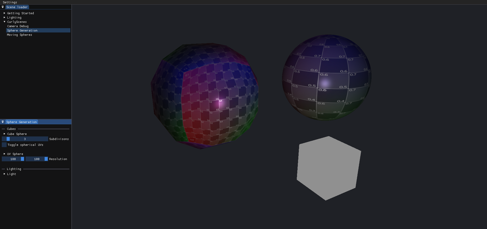

## Overview

What started off as a simple graphics programming learning experience, that continued into an engine used mainly for personal projects that require visualization. 

## Demo Usage

Navigate the different scenes through the scene loader window (top left in image). Most scenes have UI widgets, with which some properties can be tweaked, in a dedicated settings window below the scene loader (bottom left in image).

Most scenes under the "Lighting" and "CurlyScenes" groups support a first person camera which can be used to traverse the scene: 
* Activate camera controls: Hold right mouse button
* Move: WASD keys
* Look around: Mouse

## Resources

The main learning resource for this project has been [Learn OpenGL](https://learnopengl.com/). The "Getting Started" and "Lighting" scene collections can be linked to the similarly named Learn OpenGL chapters.